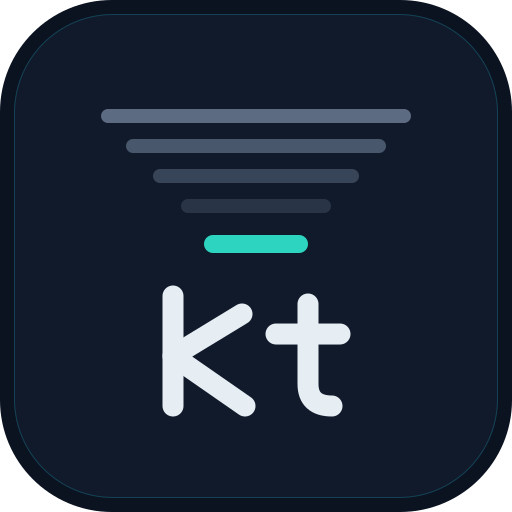

<div align="center">



### Squash the noise, keep the signal

**A CLI that cuts the token bill of AI coding agents** — it compresses shell output, blocks
token-hungry calls *before* they run, prices the session you are in, and rescues sessions whose
prompt cache has expired.

[](https://github.com/kurovu146/kuro-lean/actions/workflows/ci.yml)
[](LICENSE)
[](https://bun.sh)


**[Install](#install)** · **[Commands](#commands)** · **[Where the money goes](#where-the-money-goes)** · **[Benchmarks](#benchmarks)** · **[Configuration](#configuration)**

</div>

---

```console
$ kt run -- git diff HEAD~3 HEAD
.github/workflows/ci.yml  +1 -1
src/hooks/prompt.ts  +12 -13
src/sessions.ts  +22 -13
src/statusline.ts  +7 -10
src/transcript.ts  +69 -0
test/sessions.test.ts  +31 -0
test/statusline.test.ts  +4 -1
test/transcript.test.ts  +76 -0
↳ 405 lines compressed · full: kt show 2026-08-10T03-06-51-601Z
```

**16,564 chars → 298 chars. 98% saved**, and the full log is one command away. Run the same thing on
a *failing* test suite and you get the whole failure back, uncut — that is the trade kt makes everywhere.

Every number in this README is measured, not estimated — including the ones that say kt does
**not** help. See [How much this actually saves](#how-much-this-actually-saves).

## The 30-second version

| | What it does | Why it matters |
|---|---|---|
| 🗜️ **Compress** | `kt run -- <cmd>` prints a squashed version of noisy output and stores the full log | A 21k-char diff becomes 500 chars. Test failures are **never** compressed away |
| 🚧 **Guard** | Denies `find /`, `cat` on a 5 MB file, whole lock files, `git log -p`… | The cheapest token is the one that never enters the context |
| 💸 **Price** | `kt cost` shows the real bill from your transcripts; the status line prices the turn you are about to send | 89% of the bill is cache read + cache write, not output. Most people optimise the wrong thing |
| 🛟 **Rescue** | `kt handoff --recover` rebuilds a dead session from the on-disk transcript for ~2.5k tokens | The prompt cache expires after 1 hour. The transcript does not |

It works in two layers:

1. **Core CLI** (`kt run`, `kt show`, `kt stats`, `kt cost`, `kt handoff`) — a standalone Bun CLI.
   Runs **anywhere** Bun is installed, with any agent, or by hand.
2. **Auto-integration** (`kt init`) — registers hooks that rewrite commands, block noise and render
   a status line. This uses **Claude Code's** settings schema, so full automation is Claude Code–only.
   Other agents use the core CLI manually — see [Compatibility](#compatibility-with-other-ai-tools).

## Install

**Requires** [Bun](https://bun.sh) ≥ 1.3 (the entry point is `src/cli.ts`, run directly by Bun).

```bash
bun add -g kuro-lean   # installs the `kt` binary
kt init                # (Claude Code) register the hooks + status line
kt doctor              # verify the setup
```

No build step — `kt` runs the TypeScript directly under Bun.

<details>
<summary><b>Other ways to install</b></summary>

```bash
# straight from GitHub, no npm involved
bun add -g github:kurovu146/kuro-lean

# from source, for hacking on it
git clone https://github.com/kurovu146/kuro-lean.git && cd kuro-lean
bun install
bun link               # puts your working copy on PATH as `kt`
```

To remove it: `bun remove -g kuro-lean`. That leaves your Claude Code settings alone — the hook
entries `kt init` added stay in `~/.claude/settings.json` until you delete them, and a `.bak` from
before the install is sitting next to it.

</details>

```console
$ kt doctor
settings: ✓ /Users/you/.claude/settings.json
statusLine kt: ✓
hook-guard:    ✓
hook-compress: ✓
hook-prompt:  ✓
permission kt run: ✓
skill concise-output: ✓
skill lean-code: ✓
bun: 1.3.9
```

<details>
<summary><b>What exactly does <code>kt init</code> touch?</b></summary>

It edits `~/.claude/settings.json` and is **idempotent** — it writes a `.bak` first and never
creates a duplicate entry.

| Key | Change | Overwrite policy |
|---|---|---|
| `hooks.PreToolUse` | `kt hook-guard` + `kt hook-compress` on `Bash`, `kt hook-guard` on `Read` | appended, never replaced |
| `hooks.UserPromptSubmit` | `kt hook-prompt` | appended, never replaced |
| `statusLine` | `kt status` | **only if you have none** — a custom status line is left alone |
| `permissions.allow` | `Bash(kt run:*)` | appended |
| `~/.claude/skills/` | installs `concise-output` and `lean-code` | never overwrites an existing skill |

**Trade-off worth knowing:** `Bash(kt run:*)` is a wildcard, so anything invoked *through* `kt run`
is auto-approved. Its output still passes the compressor and the char cap, so the token risk stays
neutralised — but if you want per-command prompting, remove that entry from `permissions.allow`.

The two installed skills trim the model's *own* output, which is the most expensive kind of token.
`lean-code` makes the model write less code via an efficiency ladder inspired by the
[ponytail](https://github.com/DietrichGebert/ponytail) project (reuse → stdlib → existing deps → minimum).

</details>

## Commands

```
kt <run|status|stats|cost|handoff|init|hook-compress|hook-guard|hook-prompt|show|doctor|bench>
```

| Command | What it does |
|---|---|
| [`kt run -- <cmd>`](#kt-run) | Run a command, print compressed output, save the full log |
| `kt show [id]` | View the full log (latest run if no id) |
| [`kt stats`](#kt-stats) | Savings report from your real usage |
| [`kt cost [dir]`](#kt-cost) | The actual bill, from `usage` in this project's transcripts |
| [`kt handoff`](#kt-handoff--rescuing-a-session) | Distil a session so tomorrow starts light |
| [`kt handoff --recover`](#kt-handoff--rescuing-a-session) | Rebuild a session whose cache is already dead |
| [`kt handoff --list`](#kt-handoff---list) | Every abandoned session on the machine, ranked |
| [`kt status`](#status-line) | Render the 3-line status line (reads JSON on stdin) |
| [`kt bench`](#benchmarks) | A/B benchmark against real headless Claude sessions |
| `kt init` / `kt doctor` | Install into / inspect Claude Code settings |
| `kt hook-compress` / `kt hook-guard` / `kt hook-prompt` | The hooks — called by Claude Code, not by you |

### `kt run`

Runs the command, prints the compressed output, saves the full log under `.kt/runs/`.

**Small outputs pass through untouched.** If raw output is under `run.rawUnderChars`
(default 4,000 chars ≈ 1k tokens), `kt run` prints it verbatim — no compression, no log, no meta.
`kt bench` measured that compressing tiny outputs makes the model spend extra verification turns,
and each turn re-reads the whole context — costing more than the compression saves. Set
`"run": { "rawUnderChars": 0 }` to disable the pass-through.

### `kt stats`

```console
$ kt stats
6 runs · raw 70k ch → 9k ch left · saved 87% (~15k tokens)

Top commands still occupying context (chars after compression):
      6k ch ·   1 runs · compressed  0% · sed -n 85,155p README.md
      2k ch ·   1 runs · compressed  0% · git log --oneline -20
     771 ch ·   1 runs · compressed 99% · git diff HEAD~10 HEAD
```

The bottom list is the useful half: those are the commands still eating context after compression,
i.e. candidates for a new pattern or guard. Data comes from `.kt/runs/index.jsonl`, one line per
run, auto-trimmed to `store.keepRuns`.

### `kt cost`

The counterpart to `kt stats`. `stats` measures the shell output kt compressed; `cost` measures
where the money actually goes — usually not the same place.

```console
$ kt cost
Cost derived from real usage · total ~$92.31

  cache read      $35.30  38% ·  70.6M tok · 0.1× input · the context re-read on EVERY turn
  cache write     $33.00  36% ·   3.3M tok · 2× input · once per token loaded
  output          $24.00  26% ·  0.96M tok · what the model writes
  fresh input      $0.01   0% ·     2k tok · not cached yet

By model:
      $92.31 · 74.9M tok · claude-opus-5
```

*(Sample figures, real proportions — the 38/36/26 split is the measured one, see
[Where the money goes](#where-the-money-goes). Run it on your own project for your own numbers.)*

Read from the Claude Code transcripts for this project (main session **and** subagents). Prices
come from `pricing` in `kt.json`, matched by model-id prefix; a model with no entry is skipped
rather than guessed at.

## How compression works

Commands are classified into profiles. Small or already-quiet output is left alone.

| Profile | Behaviour |
|---|---|
| **test** | pass → the summary line only. **fail → everything from the first failure marker onward** (Expected/Received + stack), exit code preserved. Runs of ≥2 consecutive `node_modules`/`node:*` frames collapse to `… (N lib frames hidden)`; your own frames stay intact |
| **build** | OK → `✓ build OK`; otherwise only `error`/`warning` lines |
| **lint** | `eslint`, `golangci-lint`, `<pm> run lint` — clean → 1 line, otherwise error/warning lines only |
| **install** | keep `added/removed/audited/vulnerabilit…` lines; on failure keep everything |
| **git** | `git diff` ≤ 40 lines kept verbatim (the agent usually wants to *read* it); larger → `path +adds -dels` per file. `git status`/`log` fall through to generic |
| **generic** | everything else (`grep`, `sed`, `ls`, `cat`, `go run`…) — **kept verbatim**; the char cap is its only compression |

Package-manager scripts are recognised too: `npm/pnpm/yarn/bun run test|build|lint` and the
no-`run` variants map to their profile.

**Absolute char cap** (`limits.maxChars`, default 16,000 ≈ 4k tokens) applies *after* every profile,
including fallbacks. It catches what line-counting misses — one giant minified line, a huge failing
suite — keeping 65% head + 35% tail with a `… [cut ~N KB — kt show] …` marker. Set to `0` to disable.

> **Why is `generic` verbatim?** Middle-of-output matters too often for `grep`/`sed`/`ls`, and
> cutting it costs the agent a `kt show` turn. Set `generic.thresholdLines` > 0 to re-enable the old
> head/tail cut (first `headLines` + last `tailLines`).

<details>
<summary><b>Which commands the hook rewrites</b></summary>

`kt hook-compress` rewrites a Bash command into `kt run -- …` unless one of these applies:

- **Pipes / redirects / subshells / newlines** (`|`, `;`, `>`, `` ` ``, `$(…)`, `&`) — left to bash.
  `2>&1` is the exception (kt merges both streams anyway) and routes through `bash -c`.
- **`&&` chains** are rewritten as a whole through `bash -c`, *except* a leading `cd X &&`: the `cd`
  stays outside the wrapper, because Claude Code keeps the shell's working directory between Bash
  calls — burying it in a subshell would leave every later command in the wrong directory. A `cd`
  (or `export`/`source`/`nvm`…) anywhere *later* in the chain disables the rewrite entirely.
- **Long-running commands** (`--watch`, `nodemon`, `<pm> run dev|start|serve`, `next dev`, `tail -f`,
  `… logs -f`, `ping`) — wrapping them buffers until exit, i.e. hangs until the timeout.
- **Commands needing a tty** (`sudo`, `ssh`, `vim`, `less`, `psql`, `docker … -it`, `gh auth login`,
  `git rebase -i`, a bare `node`/`python3` REPL…) — `kt run` runs with stdin ignored.

</details>

<details>
<summary><b>Safety guarantees</b></summary>

- **Watch / dev commands are never wrapped**, so they cannot hang the agent. `kt run` also enforces
  `run.timeoutMs` (default 120s — raise it for slow e2e suites); a timed-out command is killed and
  whatever output it produced is still returned.
- **Env-prefixed commands** (`GIT_PAGER=cat git diff`) and `2>&1` *are* compressed, wrapped as
  `kt run -- bash -lc '<cmd>'` with single quotes escaped, so bash keeps the correct semantics.
- **Test and build failures are never compressed away** — the full error block and the exit code
  survive.

</details>

## Guard — block token-hungry calls before they run

A `PreToolUse` hook denies calls that would dump noise into the context, with a reason the agent
can act on.

| Tool | Denied |
|---|---|
| **Bash** | `find /` (whole-disk scan) · `npm ls` without `--depth` · `tree` without `-L` · `git log -p/--patch` (use `git log --oneline` + `git show <sha> -- <file>`) · `cat <file>` over `guard.maxCatKb` (100 KB) |
| **Read** | lock files (`package-lock.json`, `yarn.lock`, `bun.lockb`, `go.sum`, `Cargo.lock`…) · minified/generated (`*.min.js`, `*.min.css`, `*.map`) · anything under `node_modules/`, `dist/`, `build/`, `.next/`, `vendor/`, `coverage/` · any file over `guard.maxReadKb` (500 KB) |

**Escape hatch:** reading with an `offset`, or a small `limit` (≤ 400), is always allowed — so you
can still inspect a slice on purpose. Read is already capped at 2000 lines by Claude Code, so the
guard targets *noise*, not the size of real code files.

## Where the money goes

This is the part most token-saving tools get wrong, so here is the measurement. Same transcripts as
below: **93,124 assistant messages** with `usage`, priced at list rates (cache write at the
1-hour-TTL 2× multiplier).

| Token kind | Multiplier | Share of the bill |
|---|---|---:|
| cache read | 0.1× input | **45%** |
| cache write | 2× input | **44%** |
| output | 5× input | 10% |
| fresh input | 1× | 0.3% |

Output is the priciest token *per token* and still only a tenth of the bill. The 89% is the cost of
**putting things into the context and carrying them**, because a token you load is billed twice over:

```
cost of 1 loaded token = 2× input                          (cache write, once)
                       + 0.1× input × turns remaining      (re-read every turn)
```

On Opus 5 with 30 turns left that is $10 + $15 per million — **more than a token the model writes**
($25/M). A whole-file `Read` early in a long session outcosts the code generated from it.

Two consequences, both of which kt can only *show* you, not fix:

1. The lever is not compressing what arrives — it is **not loading it**, and **not carrying it**
   (`/clear` between unrelated tasks; subagents, whose context dies with them instead of being
   re-read every turn).
2. Filtering individual operations cannot reach this. Measured on the same data, a guard that
   blocked un-`limit`ed `Read`s of ≥20k chars nets ~0.3% — the extra turns it forces eat most of
   what it saves. That is why no such rule ships here.

### Cost is extremely concentrated in long sessions

Across **1,342 sessions**, the **top 1% (13 sessions) account for 43.7%** of the bill — all the same
shape: 600–3,000 turns with the context near the 1M ceiling. Cache-read cost scales with the
integral of context over turns, so splitting such a session along task boundaries divides that part
by roughly the number of pieces, while the only new cost — re-writing the prefix per session —
measured at $19–45 total. Cutting them into 4 is worth ~14% of the whole bill.

That is what [`kt handoff`](#kt-handoff--rescuing-a-session) is for.

### The 1-hour cache TTL, measured

Percentage of context that had to be re-written, by how long the session had been silent beforehand:

| Silence before the turn | Context re-written |
|---|---:|
| < 1 min | 3.8% |
| 30–50 min | 24.5% |
| 50–60 min | 46.6% |
| **60–90 min** | **87.6%** |
| > 90 min | 97.2% |

The cliff sits exactly at 60 minutes, measured from the **last use**, not from creation — otherwise
a long session would lose its cache every hour even while actively working, which the `< 1 min` row
rules out. Note what expiry does *not* do: the conversation is still there and still billed in full.
You lose the discount, not the history — which makes resuming an old session strictly worse than
starting a fresh one, unless you actually need that history.

### How much this actually saves

Measured over **12,220 real Bash calls** from ~2 months of Claude Code transcripts (9.8M chars of
tool output), the honest answer is: **less than you'd hope, and it depends entirely on your output shape.**

| Output size per command | Calls | Share of all chars |
|---|---:|---:|
| < 4,000 ch → passed through untouched | 11,827 | 72% |
| 4,000–16,000 ch | 381 | 25% |
| > 16,000 ch → the char cap bites | 12 | 2% |

Context there is eaten by the *number* of small commands, not by a few giant ones — and compressing
small outputs is exactly what `kt bench` measured as a net loss. So on that workload the default
config saves ~0–1%. Turning the aggressive head/tail cut back on (`generic.thresholdLines: 40`)
simulates to ~7%, but that is the setting the benchmark found costs extra agent turns. Measure with
`kt bench` before trusting it.

**Where kt still earns its place:** capping the rare huge dump, the guard (blocking `find /`, a
`cat` on a 5 MB file, whole lock files) before those tokens ever exist, and the two skills it
installs, which trim the model's *own* output. Treat `♻️ saved` as "disasters averted", not as a
running discount.

## `kt handoff` — rescuing a session

Three commands for three moments.

### Before you stop for the day

```bash
kt handoff [file]        # default: .kt/handoff.md
```

Prints a prompt asking the model to distil the session into a file: what's in flight, decisions and
*why*, next step, files touched, traps hit — explicitly **no pasted code or diffs**. Start the next
session by reading that file instead of resuming a 500k-token history. On the measured workload
that is **~$0.10 instead of ~$5.00**, and every later turn stays cheap because the context starts small.

### When you didn't get to run it

```bash
kt handoff --recover [N]           # N = messages to keep, default 60
kt handoff --recover --copy        # straight to the clipboard
kt handoff --recover --from <#|path>
```

Laptop shut, left in a hurry, remembered three days later. The prompt cache lives on Anthropic's
servers and expires; the **transcript lives on your disk** and does not. This reads the transcript,
keeps the last `N` messages, drops thinking blocks, clips tool output, and prints the result to
paste into a fresh session.

On a real 7.6 MB / 1.83M-token session that tail is **~2.5k tokens — 0.1% of the file**, and still
carries the working context. No model call, no cost, nothing in the background: the extract *is*
what the new session needs, so there is no point paying another model to summarise it first.

`--copy` puts it on the clipboard (`pbcopy` / `clip` / `xclip -selection clipboard`), where this
output was always headed, and prints the size to stderr so `> rescue.md` still works unpolluted.
If it doesn't know your platform's clipboard command it says so instead of failing quietly.

`--from` takes a row number from `--list`, or a path outright, so the repo you happen to be standing
in stops mattering. Plain `--recover` takes the newest transcript of the current directory — which
is very often the session you just opened to run a command, burying the one you actually wanted.
An out-of-range number is an error, never a guess at some other session.

### `kt handoff --list`

*Which* session, in *which* repo?

```console
$ kt handoff --list
  #  idle      context     reload    session
  1  0m          68k tok   $0.68     ~/Dev/kuro-lean (main)
  2  3m         240k tok   $2.40     ~/Dev/storefront (HEAD)
  3  8m         283k tok   $2.83     ~/Dev/storefront/api (main)
  4  13m        359k tok   $3.59     ~/Dev/storefront (feat/checkout)
  5  25m        301k tok   $3.01     ~/Dev/analytics (main)

  → kt handoff --recover --from <#> > rescue.md
```

Abandoned sessions across the **whole machine**, newest first, with repo, branch, silence, context
size and what a reload would cost — so you can see at a glance which one is worth rescuing.

<details>
<summary><b>Three details that took measuring to get right</b></summary>

**It reads the repo from inside the transcript**, not from the directory name — that name is encoded
with dashes and cannot be decoded (`kuro-lean` and `kuro/lean` collapse to the same thing).

**Teammates are left out.** One orchestrator run writes a full transcript per spawned agent into the
same project directory — 34% of the transcripts on this machine — all large and all touched minutes
apart, so they crowded out the real sessions. A teammate isn't rescuable anyway; its brief came from
the parent, which *is* listed. The marker is `teamName`, **never** `agentName` — Claude Code also
parks an auto-generated session title in `agentName`, so filtering on that hides real work.
`--from <path>` still reaches a teammate directly if you want one.

**`N` defaults to 20**, the same number `--from <#>` resolves against — kept as one constant so a row
number can never mean two different things, and high enough that a live session doesn't fall off the
end (at 10, a 585k-token session still open in another pane sat at row 13 and looked deleted).

**It is fast.** On a real machine (913 transcripts, 885 above the size floor) it runs in **0.02 s**.
`stat()` filters first, then the ranking walks newest-mtime first and stops as soon as the remaining
files *cannot* beat the rows it already holds — the last message can never be newer than the last
write, so mtime gives a lower bound on idle for free. That reads **75 files instead of 885**;
teammates are dropped on the head read before they cost a tail read, and only the rows actually
printed pay for both (16 KB head for repo/branch, 64 KB tail for usage).

</details>

### `kt hook-prompt` — stop the reload before it is paid for

A `UserPromptSubmit` hook that blocks the **first** turn sent after the cache has expired, before
the request leaves your machine.

Warning about a dead cache from the status line is too late by construction: the status line only
re-renders *after* the turn has been sent, so by the time the snowflake appears you have already
paid the reload. This hook runs first and returns `{"decision":"block"}`, so that turn costs
nothing, and shows what it would have cost plus the two ways out (resume anyway with ↑ Enter, or
`/clear` + `kt handoff --recover`).

- It blocks **exactly once** per expiry — the marker is keyed to the transcript's mtime, so
  re-sending goes straight through and you never get stuck in a loop.
- Silent below `promptGuard.idleMin` minutes of silence and below `promptGuard.minTokens` of
  context, where a reload is only worth cents.
- On a live session it costs one `stat()` (~25 ms) and reads nothing.
- It only ever looks at the transcript of **the session it was called from**, never the project's
  most recent one. A brand-new session has no transcript yet (Claude Code writes it after the turn
  starts), which means an empty context with nothing to reload — so the hook stays quiet. That is
  what keeps a fresh panel opened next to a session you abandoned last night from being blocked
  over *that* session's bill.

<details>
<summary><b>Try it without waiting an hour</b></summary>

Drop a `kt.json` with `{"promptGuard": {"idleMin": 1, "minTokens": 1000}}` into a scratch directory,
start a session there, **send one message** (so the session has a transcript), idle for a minute,
then send another.

</details>

## Status line

`kt status` reads Claude Code's JSON on stdin and renders three lines:

```
🟢 Opus 5 (1M context) · ▰▰▰▱▱▱▱▱▱▱ 32% · ~320k tok · ⏳ 2h 15m left (41% used) · $12.40 · $1.60/turn · ❄️ 2h15 · reload ~$5.00
📁 ~/Dev/kuro-lean · 🌿 main ↑2 · 📋 refactor sessions
📝 +142 -37 · ✅ 3/7 · 🔧 18 tools · ♻️ ~15k saved
```

| Segment | Meaning |
|---|---|
| 🟢 / 🟡 / 🔴 | Context fill against `statusline.warnPct` / `dangerPct` |
| `$1.60/turn` | What it costs to re-read the current context on **every following turn** (`tokens × 0.1 × input price`). It grows as the context fills, and is the cheapest reminder that `/clear` between unrelated tasks is worth money. Needs `model.id` in the JSON and a matching `pricing` entry |
| `🕐 42m` | The session has been silent that long (measured from the last message, not the file's mtime). Shown past 10 minutes |
| `❄️ 2h15 · reload ~$5.00` | The 1-hour cache TTL has expired: the next turn re-writes the whole context at 2× input, and that is the bill. **This is a receipt, not a warning** — it can only appear once a turn has been sent. `kt hook-prompt` is the part that gets there in time |
| `♻️ ~15k saved` | Tokens saved by kt for this project (same data as `kt stats`, ≈ chars/4). Hidden until the first compressed run |
| ⏳ quota · 📋 plan · ✅ todo | From the CK-stack cache / transcript when available; auto-hidden otherwise |

## Compatibility with other AI tools

| Tool | Output compression (`kt run`) | Auto command-rewrite | Guard | Status line |
|---|:---:|:---:|:---:|:---:|
| **Claude Code** | ✅ | ✅ `kt init` | ✅ `kt init` | ✅ `kt init` |
| **Cursor** | ✅ manual | ⚠️ nudge via rules | ❌ | ❌ |
| **OpenAI Codex CLI** | ✅ manual | ⚠️ nudge via `AGENTS.md` | ❌ | ❌ |
| **GitHub Copilot** | ✅ manual | ⚠️ nudge via instructions | ❌ | ❌ |
| **Gemini CLI / others** | ✅ manual | ⚠️ nudge via `GEMINI.md`/`AGENTS.md` | ❌ | ❌ |

**Why the difference:** Claude Code exposes a `PreToolUse` hook that can *rewrite* a shell command
(`updatedInput`) and *block* it (`permissionDecision: deny`) before it runs — that is the mechanism
`kt init` wires up. It also exposes `UserPromptSubmit`, which can cancel a turn *before* it is sent,
the only place a cache-expiry warning can still save money. Other agents expose no equivalent
"intercept and rewrite the shell command" hook, and the status-line protocol is Claude Code–specific.
The compression itself works everywhere — you just invoke `kt run` yourself.

<details>
<summary><b>Setup for non–Claude Code agents (manual / nudge mode)</b></summary>

1. Install the CLI as above (`bun link`), so `kt` is on PATH.
2. **Either** call it directly on noisy commands: `kt run -- npm test`
3. **Or** add an instruction so the agent prefers `kt run` on its own — `.cursor/rules/kt.mdc` for
   Cursor, `AGENTS.md` for Codex CLI, `.github/copilot-instructions.md` for Copilot, `GEMINI.md` for
   Gemini CLI:

   > When running shell commands that produce long output (tests, builds, `git diff`, install logs),
   > invoke them as `kt run -- <command>` to compress the output and save tokens. Failures are kept
   > in full, and small outputs are printed verbatim without compression. When output WAS compressed
   > (a `kt show <id>` hint is appended), use `kt show` to see the full log.

   This is a *nudge*, not enforcement — the agent decides whether to follow it. Only Claude Code
   enforces it via the hook.

</details>

## Benchmarks

### Per-command compression (this repo, 2026-08-10)

Token estimate ≈ chars / 4. Reproduce with `bash scripts/measure.sh`.

| Command | Before | After | Saved |
|---|---:|---:|---|
| `git diff HEAD~10 HEAD` | 223,278 ch (~56k tok) | 1,590 ch (~398 tok) | **99%** |
| `bun test` (pass) | 108 ch | 107 ch | 1% |
| `git log --oneline -20` | 1,840 ch | 1,840 ch | 0% (kept — correct) |
| `git status` | 865 ch | 865 ch | 0% (kept — correct) |

Already-compact output is **left untouched** on purpose. `bun test` saves little because Bun's
output is already terse; jest/vitest/go test save far more.

### End-to-end (`kt bench`)

```bash
kt bench [--runs N] [--model M] [--max-turns T] [--keep]
```

Real headless Claude Code sessions on a seeded bug-fix task (~50 tests, 1 planted bug), `baseline`
arm (`KT_DISABLE=1`) vs `kt` arm (hook wired into workspace settings). Correctness gate: a run only
counts if the fixture suite is green afterwards. ⚠ **Spends real API quota** (default 3 runs × 2 arms
on Haiku) and needs `claude` + `kt` on PATH.

**2026-07-05** — median of 3 runs/arm, Haiku 4.5, 6/6 valid:

| Metric (median) | baseline | kt | Δ |
|---|---:|---:|---:|
| Context tokens (in+cache) | 254,205 | 340,371 | +34% |
| Output tokens | 2,934 | 2,916 | −1% |
| Cost (USD) | $0.0750 | $0.0855 | +14% |
| Turns | 8 | 11 | +38% |
| Duration | 40.3s | 43.1s | +7% |

On this small fixture the `kt` arm cost **more** end-to-end: it took more agent turns, and each extra
turn re-reads the whole conversation — which swamped the few KB of tool-output compression per run.

**Follow-up shipped:** this result is what produced the small-output pass-through
(`run.rawUnderChars`). Re-measured after it — same task, **2026-07-09**, median of 3 runs/arm, 6/6 valid:

| Metric (median) | baseline | kt | Δ |
|---|---:|---:|---:|
| Context tokens (in+cache) | 238,612 | 239,830 | +1% |
| Output tokens | 2,924 | 3,256 | +11% |
| Cost (USD) | $0.0739 | $0.0781 | +6% |
| Turns | 8 | 8 | 0% |
| Duration | 38.3s | 37.3s | −3% |

The extra-turns penalty is gone; the remaining deltas are run-to-run noise. On small-output tasks kt
is now neutral instead of a net loss — the wins stay where outputs are big. Measure your own
workload: `kt bench --runs 3`.

## Configuration

**Config is entirely optional** — nothing generates a `kt.json`, and the defaults below are compiled
into the binary. You only write one to override something. Three layers, lowest first:

| Layer | File | For |
|---|---|---|
| 1 | built-in defaults | works everywhere with no file at all |
| 2 | `~/.claude/kt.json` | your preferences, once, for every project |
| 3 | `<project>/kt.json` | facts about *that* repo — a slow e2e suite's `run.timeoutMs` |

Each layer is merged **section by section**, so overriding one key never drops its siblings. A global
`{"promptGuard": {"idleMin": 30}}` keeps the default `minTokens`, and a project file that sets only
`minTokens` keeps your global `idleMin`. A malformed file drops only its own layer.

The full set of keys, with their default values:

```json
{
  "profiles": { "test": true, "build": true, "install": true, "git": true, "lint": true, "generic": true },
  "generic": { "thresholdLines": 0, "headLines": 15, "tailLines": 10 },
  "limits": { "maxChars": 16000 },
  "run": { "timeoutMs": 120000, "rawUnderChars": 4000 },
  "store": { "keepRuns": 50 },
  "statusline": { "warnPct": 60, "dangerPct": 85 },
  "guard": {
    "maxCatKb": 100,
    "maxReadKb": 500,
    "rules": { "findRoot": true, "npmLs": true, "treeNoDepth": true, "gitLogP": true, "catBig": true, "readNoise": true }
  },
  "promptGuard": { "idleMin": 60, "minTokens": 50000 },
  "pricing": { "claude-opus-5": { "input": 5, "output": 25 }, "claude-sonnet-5": { "input": 3, "output": 15 } }
}
```

- **`promptGuard.idleMin`** — silence, in minutes, after which `kt hook-prompt` blocks one turn.
  Defaults to 60 because that is the cache TTL; lower it only on the 5-minute TTL. `0` turns the hook off.
- **`promptGuard.minTokens`** — context size below which it stays quiet regardless (50k ≈ $0.50 on
  Opus). Interrupting you to save pocket change is a worse trade than the reload.
- **`pricing`** — USD per 1M tokens, keyed by model-id **prefix**, longest match wins (so
  `claude-haiku-4-5-20251001` resolves via `claude-haiku-4-5`). Merged *over* the built-in table
  rather than replacing it — override only what changed. This is the one knob to correct when
  `kt cost` looks off.

Full logs live under `.kt/runs/` (last `keepRuns` kept) — already in `.gitignore`.

## Bypass / disable

| | Effect |
|---|---|
| `KT_RAW=1 kt run -- <cmd>` | Run this one command without compression |
| `KT_DISABLE=1` | Kill switch: the hook stops rewriting, the guard stops blocking, and `hook-prompt` stops holding turns back |

## Development

```bash
bun install         # dev deps (typescript + @types/bun)
bun test            # 260 tests across 26 files
bun run typecheck   # tsc --noEmit
```

CI (GitHub Actions) runs typecheck + tests on every push and PR to `main`.

## Credits

The core mechanism — intercept the shell command, compress its output before it ever reaches the
model's context — comes from **[rtk](https://github.com/rtk-ai/rtk)**, a single Rust binary that
does this across 100+ commands. If you want the fast, language-agnostic version of this idea, use
rtk; it is the more mature tool and it is not Claude Code–specific.

kt started as a Bun/TypeScript reimplementation of that idea and then went somewhere else: deeper
Claude Code integration (`PreToolUse` and `UserPromptSubmit` hooks, a status line, the noisy-`Read`
guard), cost accounting from the transcripts, session rescue after cache expiry — and a different
default, since measuring showed that compressing *small* outputs costs more in extra agent turns
than it saves.

## Contributing

See [CONTRIBUTING.md](CONTRIBUTING.md). The short version: measure your claims, and `bun test` has
to be green. Security issues go through [SECURITY.md](SECURITY.md), not a public issue.

## License

[MIT](LICENSE) © Vu Duc Tuan

<div align="center">
<br>
<sub>Built for people who have looked at their Claude bill and wondered where it went.</sub>
</div>
